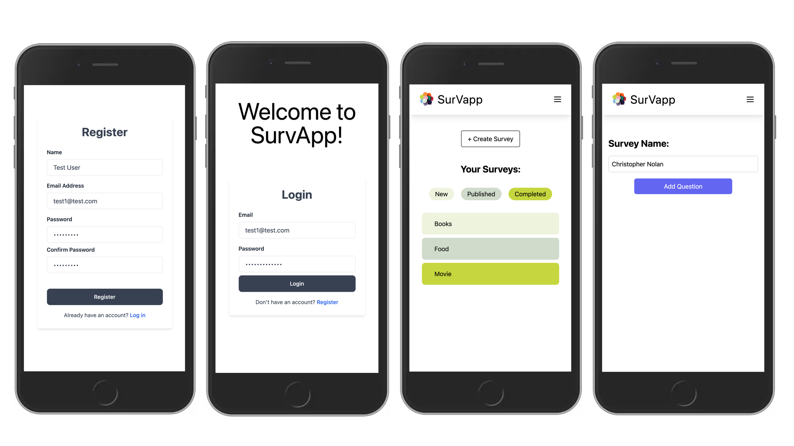
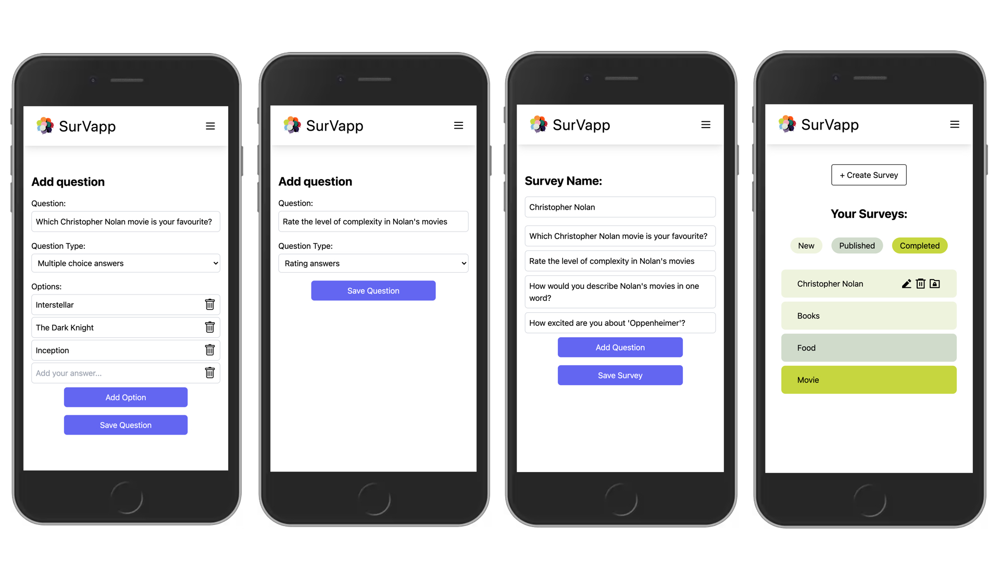
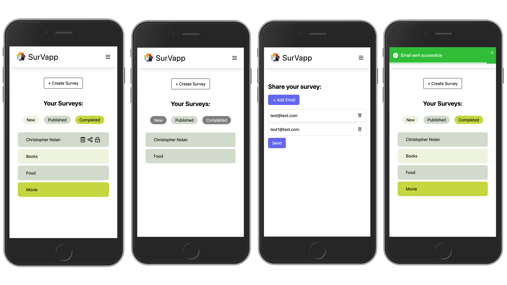
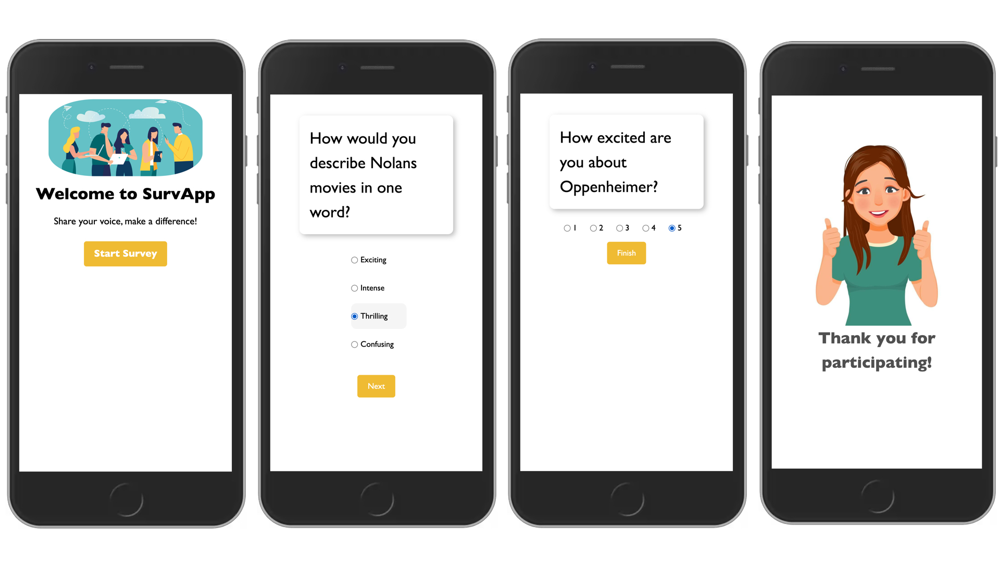

<p align="center">
  
</p>

SurvApp is a user-friendly and intuitive application that enables users to create personalized surveys. After preparing the surveys, users can easily send them to their desired recipients via email. SurvApp offers detailed statistics and valuable insights on completed surveys, and users also have the flexibility to download the survey results in PDF format.

## Features

**Survey Creation:** Users can easily craft surveys by adding questions and defining answer options. The application provides flexibility, allowing the selection of answer options in either a range format or multiple-choice format, depending on the nature of the question.

**Email Survey Distribution:** Once the surveys are prepared, users can conveniently send them to desired recipients via email. This feature ensures efficient and convenient survey deployment, enabling widespread participation.

**Survey Statistics:** SurvApp provides comprehensive statistics and insights on completed surveys. Users can view graphical representations and analyze the results in real-time, gaining valuable insights from the collected data.

**Result Download:** Users have the option to download the survey results in a user-friendly format. This enables them to further analyze the data offline, export it for reporting purposes, or integrate it into other applications as needed.


## Screenshots

<p align="center">
  
</p>
<p align="center">
  
</p>
<p align="center">
  
</p>
<p align="center">
  
</p>
<p align="center">
  
</p>

## Getting started

1. Clone the repo

```
git clone https://github.com/seymagulas/SurvApp.git
cd survapp
```

2. Create a `.env` file under `client` directory

```
cd client
touch .env
```

3. Add following variables

`REACT_APP_API_BASE_URL`


4. Create a `.env` file under `server` directory

```
cd server
touch .env
```

5. Add following variables

`BASE_URL`

`PORT`

`SECRET_KEY`

`MAIL_SERVICE`

`MAIL_USER`

`MAIL_PASS`


6. Install dependencies for backend

```
cd server
npm i
```

7. Start development server for backend

```
npm run dev
```

8. Install dependencies for frontend

```
cd client
npm i
```

9. Start development server for frontend

```
npm start
```


## Tech stack

- [React](https://react.dev) - Frontend library for building user interfaces

- [TypeScript](https://www.typescriptlang.org) - Typed JavaScript extension for enchancing code quality

- [Tailwind](https://tailwindcss.com) - Flexible CSS framework with pre-built classes for quickly styling web applications

- [Axios](https://axios-http.com/docs/intro) - Library for sending HTTP requests in JavaScript

- [Yup](https://github.com/jquense/yup) - JavaScript library for validating data against predefined rules

- [React Icons]([React Icons](https://react-icons.github.io/react-icons/)) - Library that offers a collection of ready-to-use icons for React applications

- [Toastify](https://fkhadra.github.io/react-toastify/introduction/) - Lightweight JavaScript library for creating customizable and user-friendly toast notifications

- [ChartJS](https://www.chartjs.org) - JavaScript library that simplifies the process of creating interactive and visually appealing charts and graphs on web pages

- [jsPDF](https://raw.githack.com/MrRio/jsPDF/master/docs/index.html) - Library that simplifies the generation of PDF documents in web applications by providing an easy-to-use API

- [Express.js](https://expressjs.com) - Lightweight web framework for Node.js that makes building web applications

- [MongoDB](https://www.mongodb.com) - Flexible and scalable NoSQL database that stores data in a format similar to JSON

- [Mongoose](https://mongoosejs.com) - Object Data Modeling (ODM) library for Node.js and MongoDB

- [JWT](https://jwt.io) - App security with tokens

- [Nodemailer](https://nodemailer.com/about/) - Library for sending emails using Node.js

- [Cypress](https://www.cypress.io) - End-to-end testing framework for web applications

- [Jest](https://jestjs.io) - Testing framework widely used for unit testing applications

- [Postman](https://www.postman.com) - Powerful tool for testing and documenting APIs

- [Prettifier](https://prettier.io) - Tool for making code look neat and organized by automatically adjusting its formatting

- [mongoDB Compass](https://www.mongodb.com/products/compass) - Visual GUI (Graphical User Interface) tool for MongoDB

- [Excalidraw](https://excalidraw.com) - Collaborative sketching tool for creating visual diagrams and illustrations
  
  

## Authors

Seyma Gulas (**Operations Manager**) - [Github](https://github.com/seymagulas) - [LinkedIn](https://www.linkedin.com/in/seyma-gulas)

Ines Lozano (**UI/UX Supervisor**) - [Github](https://github.com/InesLozanoLopez) - [LinkedIn](https://www.linkedin.com/in/ines-lozano-0aaa2550/)

Meera Rai (**Security Auditor**) - [Github](https://github.com/Pastlenomad) - [LinkedIn](http://www.linkedin.com/in/t.meera)

Vipin Devan (**Chief Testing Officer**) - [Github](https://github.com/Vipin-Devan) - [LinkedIn](https://www.linkedin.com/in/vipindevan/)

## License

This project is licensed under the MIT License.